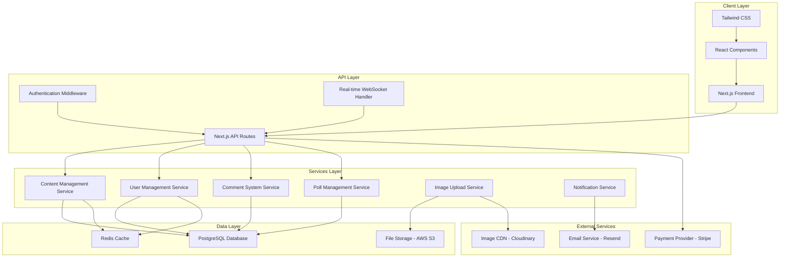

# Design Document: Lahra's Life

## Overview

Lahra's Life is a modern, interactive lifestyle website built with Next.js and React, featuring an elevated aesthetic that blends New York sophistication with New England elegance, DC power-player confidence, and coastal refinement. Think black-tie galas, Senate committee hearings, Michelin-starred dining, and wedding planning with an unapologetically luxurious twist. The application combines content management, real-time community features, and interactive polling to create an engaging platform where visitors can connect with Lahra's elevated lifestyle and participate in a sophisticated community.

The design emphasizes visual sophistication through curated image galleries, refined animations, and a cohesive design system that channels the confidence of a DC power player, the elegance of New England society, and the refined taste of a coastal foodie who knows her way around both a Senate hearing and a black-tie wedding reception.

## Architecture

### High-Level Architecture



### Technology Stack

**Frontend:**
- Next.js 14+ with App Router for server-side rendering and optimal performance
- React 18+ with concurrent features for smooth user interactions
- TypeScript for type safety and better developer experience
- Tailwind CSS for utility-first styling and responsive design
- Framer Motion for smooth animations and micro-interactions
- Socket.io Client for real-time features

**Backend:**
- Next.js API Routes for serverless backend functionality
- NextAuth.js for secure authentication and session management
- Socket.io for real-time communication (comments, polls, notifications)
- Prisma ORM for type-safe database operations
- Zod for runtime type validation and API schema validation

**Database & Storage:**
- PostgreSQL for relational data (users, comments, polls, content)
- Redis for caching and session storage
- AWS S3 for image and file storage
- Cloudinary for image optimization and transformation

**External Services:**
- Stripe for secure payment processing (donations)
- Resend for transactional email delivery
- Vercel for hosting and deployment

## Components and Interfaces

### Homepage Layout

The front page serves as the main entry point and showcases Lahra's lifestyle through a visually rich, photo-centric design:

**Hero Section:**
- Large featured photo of Lahra (rotates daily or weekly)
- Welcome message with Lahra's current mood/status
- Quick navigation to popular sections

**Content Preview Grid:**
- "What is she doing today?" with current activity photo
- "What is she wearing today?" with outfit photo
- "Favorite outfit of the month" with featured outfit photos
- Recent photos from "What's in her closet?" section
- Latest dining experience photos from "Where is Lahra eating this week?"

**Interactive Elements:**
- Active polls displayed with preview images
- Recent community comments with user avatars
- Donation widget with progress visualization

**Photo Integration:**
- All content sections prominently feature photos
- Image galleries with hover effects and smooth transitions
- Responsive image loading optimized for mobile and desktop
- Photo captions and metadata display

### Core Components

#### 1. Layout Components

**MainLayout**
```typescript
interface MainLayoutProps {
  children: React.ReactNode;
  showSidebar?: boolean;
  sidebarContent?: React.ReactNode;
}
```

**Navigation**
```typescript
interface NavigationProps {
  currentSection: string;
  user?: User;
  onSectionChange: (section: string) => void;
}
```

**Footer**
```typescript
interface FooterProps {
  showDonationCTA?: boolean;
  socialLinks: SocialLink[];
}
```

#### 2. Content Display Components

**ContentSection**
```typescript
interface ContentSectionProps {
  title: string;
  content: ContentItem[];
  layout: 'grid' | 'list' | 'carousel';
  allowComments?: boolean;
  showLikes?: boolean;
}
```

**ImageGallery**
```typescript
interface ImageGalleryProps {
  images: GalleryImage[];
  layout: 'masonry' | 'grid' | 'carousel';
  allowFullscreen?: boolean;
  showCaptions?: boolean;
}
```

**OutfitDisplay**
```typescript
interface OutfitDisplayProps {
  outfit: Outfit;
  showDetails?: boolean;
  allowVoting?: boolean;
  showComments?: boolean;
}
```

#### 3. Interactive Components

**PollWidget**
```typescript
interface PollWidgetProps {
  poll: Poll;
  userVote?: Vote;
  onVote: (optionId: string) => Promise<void>;
  showResults?: boolean;
  allowMultipleVotes?: boolean;
}
```

**CommentSystem**
```typescript
interface CommentSystemProps {
  contentId: string;
  contentType: 'outfit' | 'post' | 'poll' | 'general';
  allowReplies?: boolean;
  moderationEnabled?: boolean;
  realTimeUpdates?: boolean;
}
```

**DonationWidget**
```typescript
interface DonationWidgetProps {
  amounts: number[];
  customAmountEnabled?: boolean;
  recurringEnabled?: boolean;
  onDonationComplete: (amount: number, recurring: boolean) => void;
}
```

#### 4. Admin Components

**ContentEditor**
```typescript
interface ContentEditorProps {
  contentType: ContentType;
  initialContent?: ContentItem;
  onSave: (content: ContentItem) => Promise<void>;
  onCancel: () => void;
}
```

**ModerationPanel**
```typescript
interface ModerationPanelProps {
  pendingComments: Comment[];
  reportedContent: ReportedContent[];
  onApprove: (id: string) => Promise<void>;
  onReject: (id: string, reason: string) => Promise<void>;
}
```

### API Interfaces

#### Authentication APIs

```typescript
// POST /api/auth/register
interface RegisterRequest {
  email: string;
  password: string;
  displayName: string;
}

interface RegisterResponse {
  user: User;
  token: string;
}

// POST /api/auth/login
interface LoginRequest {
  email: string;
  password: string;
}

interface LoginResponse {
  user: User;
  token: string;
}
```

#### Content Management APIs

```typescript
// GET /api/content/sections
interface ContentSectionsResponse {
  sections: ContentSection[];
}

// POST /api/content/sections
interface CreateContentRequest {
  sectionType: 'daily-activity' | 'closet' | 'outfit' | 'dining' | 'snacks' | 'fun-facts';
  title: string;
  content: string;
  images?: string[];
  metadata?: Record<string, any>;
}

// PUT /api/content/sections/[id]
interface UpdateContentRequest {
  title?: string;
  content?: string;
  images?: string[];
  metadata?: Record<string, any>;
}
```

#### Polling APIs

```typescript
// GET /api/polls
interface PollsResponse {
  polls: Poll[];
  userVotes: Vote[];
}

// POST /api/polls
interface CreatePollRequest {
  question: string;
  options: PollOption[];
  allowMultipleVotes?: boolean;
  expiresAt?: Date;
}

// POST /api/polls/[id]/vote
interface VoteRequest {
  optionId: string;
}

interface VoteResponse {
  vote: Vote;
  updatedResults: PollResults;
}
```

#### Comment System APIs

```typescript
// GET /api/comments/[contentId]
interface CommentsResponse {
  comments: Comment[];
  totalCount: number;
  hasMore: boolean;
}

// POST /api/comments
interface CreateCommentRequest {
  contentId: string;
  contentType: string;
  content: string;
  parentId?: string;
}

// PUT /api/comments/[id]
interface UpdateCommentRequest {
  content: string;
}

// DELETE /api/comments/[id]
interface DeleteCommentResponse {
  success: boolean;
}
```

#### Payment APIs

```typescript
// POST /api/donations/create-intent
interface CreateDonationIntentRequest {
  amount: number;
  currency: 'usd';
  recurring?: boolean;
  donorInfo?: {
    name?: string;
    email?: string;
    message?: string;
  };
}

interface CreateDonationIntentResponse {
  clientSecret: string;
  donationId: string;
}

// POST /api/donations/confirm
interface ConfirmDonationRequest {
  donationId: string;
  paymentIntentId: string;
}
```

## Data Models

### User Management

```typescript
interface User {
  id: string;
  email: string;
  displayName: string;
  avatar?: string;
  role: 'user' | 'admin' | 'moderator';
  preferences: UserPreferences;
  createdAt: Date;
  updatedAt: Date;
}

interface UserPreferences {
  notifications: {
    email: boolean;
    push: boolean;
    comments: boolean;
    newContent: boolean;
    polls: boolean;
  };
  privacy: {
    showProfile: boolean;
    allowMentions: boolean;
  };
}
```

### Content Models

```typescript
interface ContentSection {
  id: string;
  type: 'daily-activity' | 'closet' | 'outfit' | 'dining' | 'snacks' | 'fun-facts' | 'mena-watchlist';
  title: string;
  content: string;
  images: ContentImage[];
  metadata: Record<string, any>;
  isPublished: boolean;
  publishedAt?: Date;
  createdAt: Date;
  updatedAt: Date;
}

interface ContentImage {
  id: string;
  url: string;
  altText: string;
  caption?: string;
  order: number;
  metadata: {
    width: number;
    height: number;
    format: string;
    size: number;
  };
}

interface Outfit {
  id: string;
  title: string;
  description?: string;
  images: ContentImage[];
  items: OutfitItem[];
  occasion?: string;
  season?: string;
  isFavorite: boolean;
  isOutfitOfMonth: boolean;
  createdAt: Date;
}

interface OutfitItem {
  id: string;
  name: string;
  brand?: string;
  category: 'dress' | 'top' | 'bottom' | 'shoes' | 'accessory' | 'jewelry';
  color: string;
  purchaseUrl?: string;
  price?: number;
}
```

### Interactive Features Models

```typescript
interface Poll {
  id: string;
  question: string;
  description?: string;
  options: PollOption[];
  allowMultipleVotes: boolean;
  isActive: boolean;
  expiresAt?: Date;
  createdAt: Date;
  updatedAt: Date;
}

interface PollOption {
  id: string;
  text: string;
  image?: string;
  voteCount: number;
  order: number;
}

interface Vote {
  id: string;
  pollId: string;
  optionId: string;
  userId: string;
  createdAt: Date;
}

interface Comment {
  id: string;
  contentId: string;
  contentType: string;
  userId: string;
  user: User;
  content: string;
  parentId?: string;
  replies?: Comment[];
  likes: number;
  isModerated: boolean;
  isApproved: boolean;
  createdAt: Date;
  updatedAt: Date;
}
```

### Donation Models

```typescript
interface Donation {
  id: string;
  amount: number;
  currency: string;
  isRecurring: boolean;
  status: 'pending' | 'completed' | 'failed' | 'cancelled';
  paymentIntentId: string;
  donorInfo?: {
    name?: string;
    email?: string;
    message?: string;
    isAnonymous: boolean;
  };
  userId?: string;
  createdAt: Date;
  completedAt?: Date;
}

interface DonationGoal {
  id: string;
  title: string;
  description: string;
  targetAmount: number;
  currentAmount: number;
  isActive: boolean;
  deadline?: Date;
  createdAt: Date;
}
```

## Correctness Properties

*A property is a characteristic or behavior that should hold true across all valid executions of a system—essentially, a formal statement about what the system should do. Properties serve as the bridge between human-readable specifications and machine-verifiable correctness guarantees.*

### Property 1: Poll Voting Consistency
*For any* poll and any user, when the user submits a vote, the vote should be recorded in the database and the poll results should immediately reflect the updated vote count and percentages.
**Validates: Requirements 2.1, 2.2, 2.6**

### Property 2: User Authentication Round Trip
*For any* valid user credentials, successful login followed by logout should properly establish and then terminate the user session without leaving residual authentication state.
**Validates: Requirements 3.2, 3.4**

### Property 3: User Registration and Verification
*For any* valid registration data, creating a user account should generate a secure account with proper email verification and allow subsequent login with the provided credentials.
**Validates: Requirements 3.1**

### Property 4: Profile Update Persistence
*For any* authenticated user and valid profile data, updating profile information should persist the changes and reflect them immediately in all relevant user interface elements.
**Validates: Requirements 3.3**

### Property 5: Password Reset Functionality
*For any* registered user email, initiating password reset should send a secure reset link that allows the user to successfully change their password and login with the new credentials.
**Validates: Requirements 3.5**

### Property 6: Comment Threading Consistency
*For any* comment and reply, when a user replies to an existing comment, the reply should be properly associated with the parent comment and displayed in the correct threaded structure.
**Validates: Requirements 4.1, 4.2**

### Property 7: Content Moderation Flagging
*For any* comment containing inappropriate content, the moderation system should flag the content and prevent it from being displayed until approved by a moderator.
**Validates: Requirements 4.3**

### Property 8: Comment Reaction Recording
*For any* comment and user interaction, when a user likes or reacts to a comment, the reaction should be recorded and the comment's reaction count should be updated immediately.
**Validates: Requirements 4.5**

### Property 9: Image Upload Validation
*For any* uploaded image file, the system should validate the file format and size requirements, rejecting invalid files with appropriate error messages and accepting valid files for processing.
**Validates: Requirements 5.1**

### Property 10: Image Storage and Optimization
*For any* valid uploaded image, the system should store the image securely, apply appropriate compression and optimization, and make it available for display across the website.
**Validates: Requirements 5.2**

### Property 11: Responsive Image Display
*For any* image gallery and screen size, the gallery should adapt its layout appropriately to the viewport dimensions while maintaining image quality and accessibility.
**Validates: Requirements 5.3, 7.1, 7.2, 7.3**

### Property 12: Image Loading Performance
*For any* image displayed on the website, the image should load efficiently with progressive enhancement and not block the rendering of other page content.
**Validates: Requirements 5.4**

### Property 13: Image Categorization
*For any* uploaded image and content section, Lahra should be able to assign the image to the appropriate category and the image should appear in the correct content section.
**Validates: Requirements 5.5**

### Property 14: Animation Functionality
*For any* user interaction that triggers an animation, the animation should execute smoothly without blocking other interface functionality or causing performance degradation.
**Validates: Requirements 6.4**

### Property 15: Accessibility Feature Compliance
*For any* website feature, keyboard navigation and screen reader support should provide equivalent functionality to mouse-based interactions.
**Validates: Requirements 7.4**

### Property 16: Content Update Propagation
*For any* content update made through the admin interface, the changes should be reflected immediately across all relevant sections of the website where that content appears.
**Validates: Requirements 8.2, 8.4**

### Property 17: Content Version Control
*For any* content item, the system should maintain a history of changes and allow reverting to any previous version while preserving the content's integrity.
**Validates: Requirements 8.5**

### Property 18: Content Notification Delivery
*For any* new content publication, subscribed users should receive notifications through their preferred channels according to their notification preferences.
**Validates: Requirements 9.1**

### Property 19: Reply Notification System
*For any* comment reply, the original commenter should receive a notification about the reply if they have reply notifications enabled in their preferences.
**Validates: Requirements 9.2**

### Property 20: Real-time Update Delivery
*For any* poll result change or community activity, users viewing the relevant content should receive real-time updates without needing to refresh the page.
**Validates: Requirements 9.3**

### Property 21: Mention Notification System
*For any* comment containing a user mention, the mentioned user should receive a notification if they have mention notifications enabled in their preferences.
**Validates: Requirements 9.4**

### Property 22: Notification Preference Enforcement
*For any* user notification preference setting, the system should respect the user's choices and only send notifications through enabled channels at the specified frequency.
**Validates: Requirements 9.5**

### Property 23: Fun Facts Content Management
*For any* fun fact content, Lahra should be able to add, update, or remove fun facts through the admin interface and the changes should be reflected immediately in the fun facts section.
**Validates: Requirements 10.4**

### Property 24: Donation Processing Security
*For any* donation attempt, the payment should be processed securely through the payment provider with proper encryption and validation, returning appropriate success or failure responses.
**Validates: Requirements 11.2**

### Property 25: Donation Confirmation System
*For any* completed donation, the system should provide immediate confirmation to the donor and record the donation details for tracking and acknowledgment purposes.
**Validates: Requirements 11.4**

## Error Handling

### Client-Side Error Handling

**Form Validation Errors:**
- Real-time validation feedback for user inputs
- Clear error messages with specific guidance for correction
- Prevention of form submission with invalid data
- Graceful handling of network timeouts during form submission

**Image Upload Errors:**
- File size and format validation with user-friendly error messages
- Progress indicators for large file uploads
- Retry mechanisms for failed uploads
- Fallback handling for unsupported file types

**Authentication Errors:**
- Clear messaging for invalid credentials
- Account lockout protection with appropriate user notification
- Session expiration handling with automatic redirect to login
- Password strength validation with helpful requirements display

### Server-Side Error Handling

**Database Connection Errors:**
- Connection pooling with automatic retry logic
- Graceful degradation when database is unavailable
- Transaction rollback for failed operations
- Logging of database errors for monitoring and debugging

**External Service Failures:**
- Stripe payment processing failures with user-friendly error messages
- Email service failures with queuing and retry mechanisms
- Image CDN failures with fallback to local storage
- Real-time service failures with graceful fallback to polling

**API Rate Limiting:**
- Proper HTTP status codes for rate limit violations
- Clear messaging about rate limits to users
- Exponential backoff for automated retry attempts
- Monitoring and alerting for unusual traffic patterns

### Error Recovery Strategies

**Data Consistency:**
- Atomic operations for critical data updates
- Compensation patterns for distributed transaction failures
- Data validation at multiple layers (client, API, database)
- Regular data integrity checks and automated repair

**User Experience:**
- Offline functionality for core features where possible
- Progressive enhancement for non-critical features
- Clear loading states and progress indicators
- Helpful error messages with suggested actions

## Testing Strategy

### Dual Testing Approach

The testing strategy employs both unit testing and property-based testing to ensure comprehensive coverage:

**Unit Tests:**
- Focus on specific examples, edge cases, and error conditions
- Test individual component behavior and integration points
- Validate specific user workflows and business logic
- Cover error handling and boundary conditions

**Property-Based Tests:**
- Verify universal properties across all possible inputs
- Use randomized test data to discover edge cases
- Validate system behavior under various conditions
- Ensure correctness properties hold for all valid scenarios

### Property-Based Testing Configuration

**Framework Selection:**
- **JavaScript/TypeScript**: fast-check library for comprehensive property testing
- **Minimum 100 iterations** per property test to ensure thorough coverage
- **Custom generators** for domain-specific data types (users, polls, comments, images)

**Test Organization:**
- Each correctness property implemented as a single property-based test
- Tests tagged with feature name and property reference
- Tag format: **Feature: lahras-life, Property {number}: {property_text}**
- Grouped by functional area (authentication, content, polling, etc.)

### Unit Testing Strategy

**Component Testing:**
- React component rendering and interaction testing
- Props validation and state management verification
- Event handling and callback execution testing
- Accessibility compliance testing for interactive elements

**API Testing:**
- Request/response validation for all endpoints
- Authentication and authorization testing
- Error response handling and status code verification
- Rate limiting and security testing

**Integration Testing:**
- Database operations and data persistence testing
- External service integration testing (Stripe, email, CDN)
- Real-time feature testing with WebSocket connections
- End-to-end user workflow testing

### Performance Testing

**Load Testing:**
- Concurrent user simulation for polling and commenting features
- Database performance under high read/write loads
- Image upload and processing performance testing
- Real-time feature scalability testing

**Optimization Validation:**
- Image compression and CDN delivery testing
- Page load time measurement across device types
- Bundle size optimization and code splitting verification
- Caching strategy effectiveness testing

### Security Testing

**Authentication Security:**
- Password hashing and storage validation
- Session management and token security testing
- CSRF protection and XSS prevention testing
- Rate limiting and brute force protection testing

**Data Protection:**
- Input sanitization and validation testing
- SQL injection prevention testing
- File upload security and malware scanning
- Personal data handling and privacy compliance testing

### Monitoring and Observability

**Application Monitoring:**
- Real-time error tracking and alerting
- Performance metrics collection and analysis
- User behavior analytics and engagement tracking
- System health monitoring and uptime tracking

**Testing Metrics:**
- Code coverage reporting for unit and integration tests
- Property test execution statistics and failure analysis
- Performance benchmark tracking over time
- Security vulnerability scanning and reporting